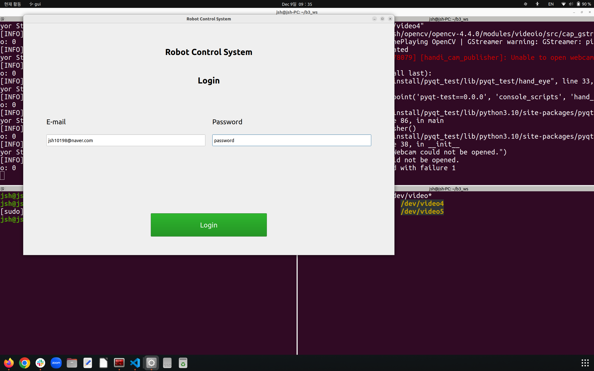
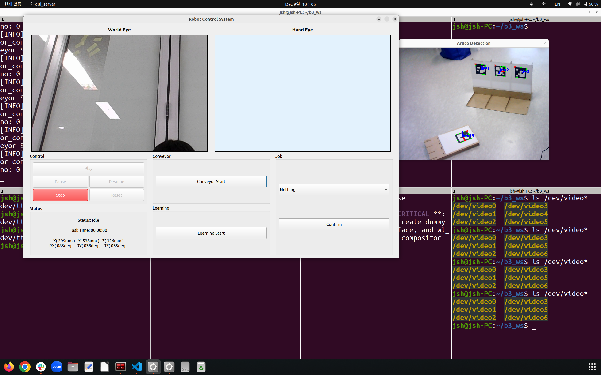
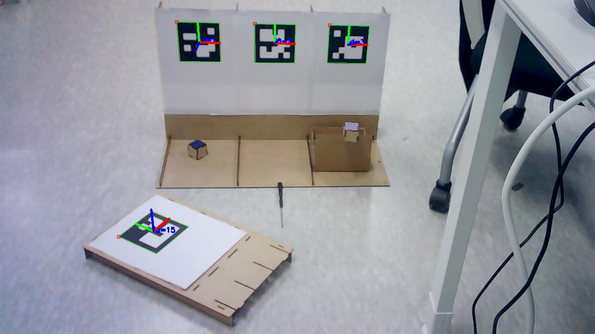
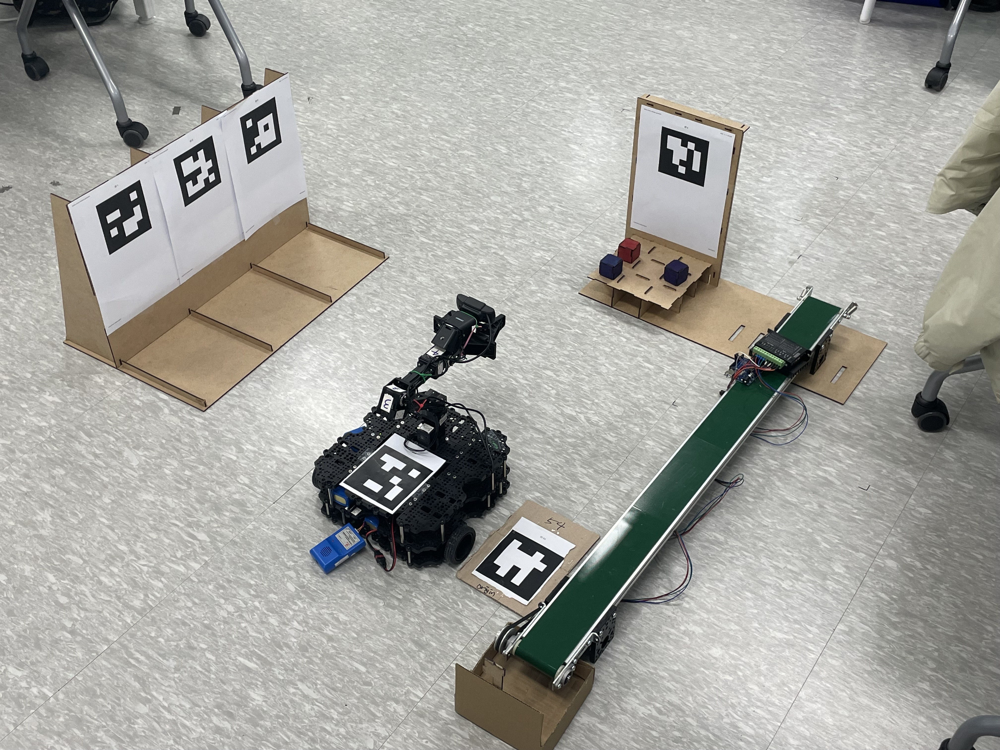

## Overview
Use the ArUco marker to calculate the relative coordinates and move Turtlebot3 to the corresponding location. Recognize a small box as an object with yolo8, pick it up with the manipulator, and place it on the conveyor belt. Pick up the box again at the end of the conveyor belt and move it to the unloading area. 

## Capture

### GUI 로 Login 창을 띄운 모습
<p align="center">
   
</p>

#### Login 입력정보
ID: rokey,   Password: 1234

### Login 후 World Eye 로 ArUco 마커를 감지하는 모습
<p align="center">
 
</p>

### 기준마커(ID:2)를 통해 목표마커(ID:15)의 좌표 계산하기
벽에 수직으로 붙은 ArUco 마커의 z, x 값을 이용하여 목표좌표의 상대거리(tvecs)및 방향(rvecs)을 계산합니다.

```python

# 기준 마커의 회전 행렬 계산
R_base, _ = cv2.Rodrigues(base_rvec)  # 기준 마커의 회전 행렬
R_base_inv = np.linalg.inv(R_base)    # 회전 행렬의 역행렬

# 타겟 마커의 이동 벡터를 기준 좌표계로 변환
tvec_relative = R_base_inv @ (target_tvec.T - base_tvec.T)

# z, x 성분만 추출
tvec_relative_xz = tvec_relative[[0, 2]]  # z, x 좌표 (상대 이동)
distance = np.linalg.norm(tvec_relative_xz)  # 거리 계산
direction_vector = tvec_relative_xz / distance  # 방향 벡터 (단위 벡터)

# z, x를 기반으로 각도 계산 (atan2 사용)
angle_rad = np.arctan2(tvec_relative_xz[1], tvec_relative_xz[0])  # 라디안 단위
```
<p align="center">
 
</p>

### World Eye에서 본 Virtual Factory
<p align="center">
 
</p>

### Turtlebot3 Manipulating Video
[Turtlebot3 Manipulating Demo Video](capture/manipulating.MOV)

### Pick and Place On Conveyorbelt Demo Video
[Pick and Place On Conveyorbelt Demo Video](capture/PickandPlaceOnConveyorbelt.mp4)

## How to execute

GUI 서버 실행시키기
```console
ros2 run virtual_factory gui
```

Aruco 마커 탐지 노드 실행시키기
```console
ros2 run virtual_factory aruco
```

AMR 실행시키기
```console
ros2 run virtual_factory amr
```

Manipulator 실행시키기
```console
ros2 run virtual_factory manipulator
```
